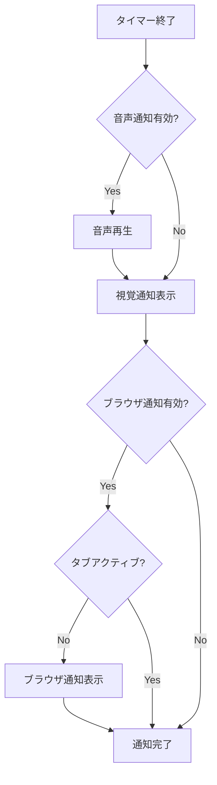

# 設計文書

## 概要

ポモドーロタイマーアプリは、React + TypeScript + Viteを使用したシングルページアプリケーション（SPA）として実装します。状態管理にはZustandを使用し、UIはTailwindCSSでスタイリングします。オフライン対応のためにService WorkerとlocalStorageを活用し、ブラウザ通知とWeb Audio APIで通知機能を実装します。

## アーキテクチャ

### 技術スタック
- **フロントエンド**: React 19 + TypeScript
- **ビルドツール**: Vite
- **状態管理**: Zustand
- **スタイリング**: TailwindCSS
- **テスト**: Vitest + React Testing Library
- **データ永続化**: localStorage
- **オフライン対応**: Service Worker
- **通知**: Web Notifications API + Web Audio API

### アーキテクチャパターン
- **コンポーネント設計**: 機能別コンポーネント分割
- **状態管理**: 単一のグローバルストア（Zustand）
- **データフロー**: 単方向データフロー
- **永続化**: localStorage + 自動同期

## コンポーネント構成とインターフェース

### コンポーネント階層
```
App
├── Header
├── TimerDisplay
├── TimerControls
├── SettingsPanel
├── SessionHistory
├── Statistics
└── NotificationManager
```

### 主要コンポーネント

#### TimerDisplay
- **責務**: 現在のタイマー状態と残り時間の表示
- **Props**: `timeLeft: number`, `isRunning: boolean`, `sessionType: 'work' | 'break'`
- **状態**: なし（純粋コンポーネント）

#### TimerControls
- **責務**: タイマーの開始・停止・リセット制御
- **Props**: `onStart: () => void`, `onPause: () => void`, `onReset: () => void`, `isRunning: boolean`
- **状態**: なし（純粋コンポーネント）

#### SettingsPanel
- **責務**: タイマー時間のカスタマイズ設定
- **Props**: `settings: TimerSettings`, `onSettingsChange: (settings: TimerSettings) => void`
- **状態**: フォーム入力の一時状態

#### SessionHistory
- **責務**: 完了したセッションの履歴表示
- **Props**: `sessions: Session[]`
- **状態**: 表示フィルター状態

#### Statistics
- **責務**: 生産性統計とチャートの表示
- **Props**: `sessions: Session[]`
- **状態**: チャート表示期間の状態

## データモデル

### TimerState
```typescript
interface TimerState {
  timeLeft: number;           // 残り時間（秒）
  isRunning: boolean;         // タイマー実行中フラグ
  isPaused: boolean;          // 一時停止フラグ
  sessionType: SessionType;   // 現在のセッションタイプ
  currentSession: number;     // 現在のセッション番号
}
```

### TimerSettings
```typescript
interface TimerSettings {
  workDuration: number;       // 作業時間（分）
  shortBreakDuration: number; // 短い休憩時間（分）
  longBreakDuration: number;  // 長い休憩時間（分）
  longBreakInterval: number;  // 長い休憩の間隔
  autoStartBreaks: boolean;   // 休憩の自動開始
  autoStartWork: boolean;     // 作業の自動開始
}
```

### Session
```typescript
interface Session {
  id: string;                 // セッションID
  type: SessionType;          // セッションタイプ
  startTime: Date;            // 開始時刻
  endTime: Date;              // 終了時刻
  duration: number;           // 実際の時間（秒）
  completed: boolean;         // 完了フラグ
}
```

### SessionType
```typescript
type SessionType = 'work' | 'shortBreak' | 'longBreak';
```

## 状態管理設計

### Zustandストア構造
```typescript
interface PomodoroStore {
  // タイマー状態
  timer: TimerState;
  
  // 設定
  settings: TimerSettings;
  
  // セッション履歴
  sessions: Session[];
  
  // 通知設定
  notifications: {
    sound: boolean;
    browser: boolean;
    volume: number;
  };
  
  // アクション
  startTimer: () => void;
  pauseTimer: () => void;
  resetTimer: () => void;
  updateSettings: (settings: Partial<TimerSettings>) => void;
  completeSession: () => void;
  loadData: () => void;
  saveData: () => void;
}
```

### 状態の永続化
- **localStorage**: 設定、セッション履歴、通知設定
- **自動保存**: 状態変更時に自動的にlocalStorageに保存
- **初期化**: アプリ起動時にlocalStorageから状態を復元

## エラーハンドリング

### エラーカテゴリ
1. **タイマーエラー**: setInterval/clearIntervalの失敗
2. **ストレージエラー**: localStorage読み書きエラー
3. **通知エラー**: 通知権限拒否、音声再生失敗
4. **バリデーションエラー**: 設定値の不正入力

### エラー処理戦略
- **グレースフルデグラデーション**: 機能の一部が失敗してもアプリは継続動作
- **ユーザーフィードバック**: エラー発生時の適切な通知表示
- **フォールバック**: 通知失敗時の代替手段提供
- **ログ記録**: 開発時のデバッグ用エラーログ

### 具体的なエラー処理
```typescript
// 通知エラーの例
const playNotificationSound = async () => {
  try {
    await audioContext.resume();
    notificationSound.play();
  } catch (error) {
    console.warn('音声通知の再生に失敗しました:', error);
    // 視覚的通知にフォールバック
    showVisualNotification();
  }
};
```

## 通知システム設計

### 通知タイプ
1. **音声通知**: Web Audio APIを使用した効果音
2. **視覚通知**: アプリ内のモーダル・トースト表示
3. **ブラウザ通知**: Notifications APIを使用

### 通知フロー


### 権限管理
- **初回起動時**: 通知権限のリクエスト
- **設定画面**: 権限状態の表示と再リクエスト機能
- **フォールバック**: 権限拒否時の代替通知方法

## テスト戦略

### テストレベル
1. **単体テスト**: 個別コンポーネントとユーティリティ関数
2. **統合テスト**: コンポーネント間の相互作用
3. **E2Eテスト**: ユーザーシナリオの完全なフロー

### テスト対象
- **タイマー機能**: 開始・停止・リセットの動作
- **状態管理**: Zustandストアの状態変更
- **永続化**: localStorage読み書き
- **通知**: 各種通知の発火条件
- **設定**: バリデーションと保存

### テストツール
- **Vitest**: テストランナー
- **React Testing Library**: コンポーネントテスト
- **MSW**: API モック（将来の拡張用）
- **@testing-library/user-event**: ユーザーインタラクション

### テスト例
```typescript
describe('TimerControls', () => {
  it('開始ボタンクリック時にonStartが呼ばれる', async () => {
    const onStart = vi.fn();
    render(<TimerControls onStart={onStart} isRunning={false} />);
    
    await user.click(screen.getByRole('button', { name: '開始' }));
    
    expect(onStart).toHaveBeenCalledOnce();
  });
});
```

## パフォーマンス考慮事項

### 最適化戦略
1. **メモ化**: React.memo、useMemo、useCallbackの適切な使用
2. **レンダリング最適化**: 不要な再レンダリングの防止
3. **タイマー精度**: requestAnimationFrameとsetIntervalの使い分け
4. **バンドルサイズ**: 不要な依存関係の除去

### 具体的な実装
```typescript
// 高精度タイマーの実装例
const useHighPrecisionTimer = (callback: () => void, delay: number) => {
  const savedCallback = useRef(callback);
  
  useEffect(() => {
    savedCallback.current = callback;
  }, [callback]);
  
  useEffect(() => {
    if (delay !== null) {
      const id = setInterval(() => savedCallback.current(), delay);
      return () => clearInterval(id);
    }
  }, [delay]);
};
```

## セキュリティ考慮事項

### データ保護
- **ローカルストレージ**: 機密情報は保存しない
- **XSS対策**: React標準のエスケープ機能を活用
- **CSP**: Content Security Policyの設定

### プライバシー
- **データ収集**: ユーザーデータの外部送信なし
- **権限**: 必要最小限の権限のみ要求
- **透明性**: データ使用方法の明確化

## 将来の拡張性

### 拡張可能な設計
1. **プラグインシステム**: カスタム通知音の追加
2. **テーマシステム**: ダークモード・カスタムテーマ
3. **データエクスポート**: CSV/JSON形式でのデータ出力
4. **同期機能**: クラウド同期の追加準備

### アーキテクチャの柔軟性
- **状態管理**: Zustandから他のライブラリへの移行容易性
- **コンポーネント**: 再利用可能な設計
- **API**: 将来のバックエンド連携に対応可能な構造